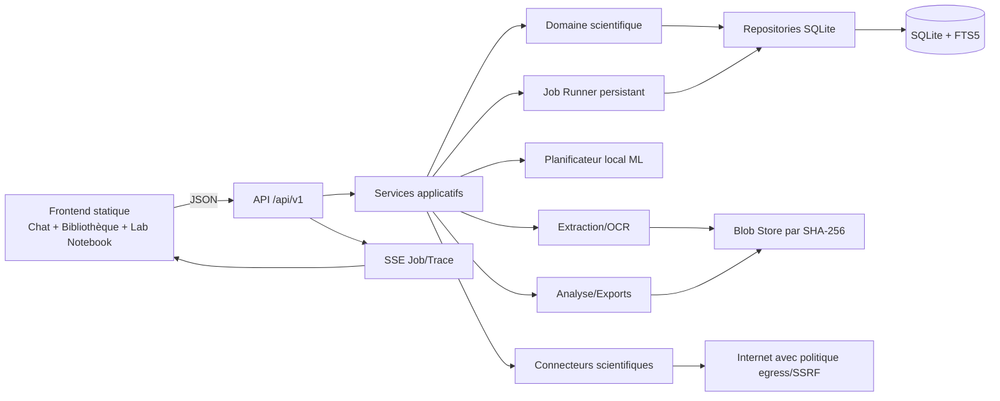
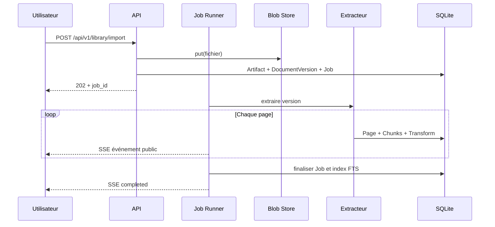

# Document de conception — Espace de recherche scientifique

## 1. Vue d’ensemble

La fonctionnalité est ajoutée à 3loop comme un **monolithe modulaire local-first**. Le processus desktop et le `ThreadingHTTPServer` existants restent le socle d’exécution ; les nouvelles responsabilités sont isolées en modules métier testables, persistées dans SQLite et exposées sous `/api/v1`. Le frontend HTML/CSS/JavaScript existant reçoit des composants progressifs plutôt qu’une réécriture de framework.

Le design repose sur quatre invariants :

1. une sortie scientifique ne peut pas prétendre être vérifiée sans preuve résoluble ;
2. une citation pointe toujours vers une version immuable de sa source ;
3. tout egress est explicite et contrôlé ;
4. la trace visible est un journal d’actions auditables, jamais le raisonnement interne brut du modèle.

Ce document couvre les exigences 1 à 20 de `requirements.md`.

## 2. Contraintes du produit existant

- Backend Python local basé sur `ThreadingHTTPServer`, JSON et SSE.
- Frontend statique dans `web/`, sans chaîne de build JavaScript obligatoire.
- Conversations et documents historiques partiellement conservés côté navigateur ou en mémoire.
- Extraction PDF actuelle aplatie en texte, sans version/page/chunk durable.
- Recherche web actuelle générique ; modèles métier limités.
- Distribution Windows PyInstaller et fonctionnement hors ligne attendus.

La migration doit donc être additive : les routes existantes restent disponibles pendant que le frontend bascule vers `/api/v1`.

## 3. Architecture cible



### 3.1 Modules proposés

```text
three_loop/
  research/
    db.py                 # connexion, transactions, pragmas
    migrations.py         # registre et exécution des migrations
    schema/               # scripts SQL embarqués
    blobs.py              # stockage adressé par SHA-256
    domain.py             # entités et types stables
    repositories.py       # accès SQLite sans SQL dans les handlers
    services/
      library.py
      ingestion.py
      extraction.py
      provenance.py
      claims.py
      search.py
      reviews.py
      notebook.py
      analysis.py
      experiments.py
      exports.py
    jobs.py               # file persistante, reprise, annulation
    events.py             # événements publics de trace
    security.py           # egress, URL, sanitization, secrets
    connectors/
      base.py
      crossref.py
      openalex.py
      arxiv.py
      pubmed.py
      semantic_scholar.py
      openreview.py
      papers_with_code.py
      huggingface.py
    ml/
      planner.py
      schemas.py
      prompts.py
      evidence.py
    api.py                # routes /api/v1
web/
  app.js                  # intégration et compatibilité
  research-api.js
  research-store.js
  lab-notebook.js
  library.js
  style.css
```

Les fichiers exacts pourront être regroupés au début pour limiter le churn, mais les frontières de responsabilité doivent rester celles-ci.

## 4. Stockage local

### 4.1 Emplacement et cycle de vie

Un répertoire de données applicatif contient :

```text
<data-dir>/
  research.sqlite3
  blobs/ab/cd/<sha256>
  backups/
  exports/
  logs/
```

Le chemin est déterminé par le profil 3loop, pas par le répertoire d’installation PyInstaller. SQLite utilise `foreign_keys=ON`, `journal_mode=WAL`, `busy_timeout` et des transactions courtes. Chaque thread obtient sa propre connexion.

### 4.2 Migrations

Table `schema_migrations(version, name, checksum, applied_at)`. Au démarrage :

1. acquérir un verrou de migration ;
2. vérifier les checksums déjà appliqués ;
3. sauvegarder la base avant une migration destructive ;
4. appliquer chaque migration dans une transaction quand SQLite le permet ;
5. démarrer les services seulement après succès.

Une migration ne modifie jamais un script déjà publié ; une correction crée une nouvelle version.

### 4.3 Blob store

`BlobStore.put(stream)` écrit d’abord dans un fichier temporaire, calcule SHA-256, vérifie la taille, effectue un renommage atomique puis retourne `(hash, size, media_type)`. Les blobs sont immuables. La suppression physique est un garbage collection explicite après vérification qu’aucune table ne les référence.

_Références : 1.1–1.6, 16.7, 19.4–19.6, 20.2._

## 5. Modèle de données

Les identifiants sont des UUID textuels. Les timestamps sont ISO 8601 UTC. Les champs structurés stables sont normalisés ; les réponses brutes de fournisseurs sont conservées sous forme JSON versionnée uniquement quand elles sont utiles à la provenance.

### 5.1 Bibliothèque et documents

| Table | Champs essentiels |
|---|---|
| `papers` | `id`, `title`, `abstract`, `year`, `status`, timestamps |
| `identifiers` | `id`, `paper_id`, `scheme`, `value_normalized`, `source_id`, unique `(scheme,value_normalized)` |
| `authors` | `id`, `display_name`, `orcid` |
| `paper_authors` | `paper_id`, `author_id`, `position`, `role` |
| `venues` | `id`, `name`, `issn`, `kind` |
| `artifacts` | `id`, `paper_id`, `kind`, `uri`, `blob_hash`, `media_type`, `source_id` |
| `document_versions` | `id`, `artifact_id`, `version_label`, `blob_hash`, `acquired_at`, `source_id` |
| `pages` | `id`, `version_id`, `physical_index`, `logical_label`, `width`, `height`, `text_hash` |
| `chunks` | `id`, `page_id`, `ordinal`, `start_offset`, `end_offset`, `text`, `text_hash`, `method`, `transform_id` |
| `figures` / `tables` | page, zone JSON, légende, blob ou données, transform |
| `collections` | `id`, `name`, `parent_id` |
| `collection_items` | `collection_id`, `entity_type`, `entity_id` |
| `tags` / `entity_tags` | taxonomie locale et association polymorphe contrôlée |

FTS5 indexe titres, résumés, chunks, notes et glossaire. Les index FTS sont reconstruisibles et ne sont pas la source de vérité.

### 5.2 Provenance, claims et citations

| Table | Champs essentiels |
|---|---|
| `sources` | fournisseur, URI canonique, date d’accès, licence, payload hash |
| `transforms` | type, version, paramètres JSON, modèle/moteur, dates |
| `transform_inputs` | `transform_id`, type/id/hash de l’entrée |
| `claims` | texte atomique, statut (`supported`, `conflicting`, `unverified`), auteur logique |
| `citations` | `claim_id`, `source_id`, `version_id`, `page_id`, `chunk_id`, offsets, extrait, locator JSON |
| `provenance_edges` | sujet, relation, objet, transform/source, timestamp |
| `tombstones` | type/id supprimé, résumé minimal, date et raison |

Une citation n’est jamais mise à jour pour viser une nouvelle version. Une nouvelle extraction produit de nouveaux chunks et, si nécessaire, de nouvelles citations. L’extrait est borné ; le blob/version reste l’autorité. Une contrainte applicative vérifie que `page.version_id == citation.version_id` et que le chunk appartient à la page.

### 5.3 Recherche, conversations et jobs

| Table | Champs essentiels |
|---|---|
| `conversations` / `messages` | contenu, rôle, statut, dates, format de rendu |
| `research_runs` | question, plan JSON, profil, statut, politique egress |
| `search_queries` | run, fournisseur, requête, filtres, date, statut |
| `search_results` | query, identifiants, métadonnées, score, source |
| `jobs` | type, status, progress, params JSON, result JSON, cancel flag, attempts, lease |
| `job_events` | job, séquence, type public, résumé, payload sûr, timestamp |
| `message_traces` | message final, job, résumé, compteurs, état UI par défaut |

`job_events` est append-only. Le client déduplique par `(job_id, sequence)`.

### 5.4 Connaissances, analyses et expériences

Tables principales : `notes`, `annotations`, `glossary_terms`, `reviews`, `review_revisions`, `screening_decisions`, `datasets`, `dataset_versions`, `analysis_runs`, `charts`, `experiments`, `experiment_runs`, `watches`, `watch_runs`, `graph_edges`, `exports` et `integration_accounts`.

Les recettes d’analyse référencent toujours une version de dataset, des paramètres et des versions logicielles. Les comptes d’intégration ne contiennent qu’un identifiant de secret ; la valeur est stockée dans le coffre du système.

_Références : 2, 3, 4, 8–15, 17, 20._

## 6. Flux métier principaux

### 6.1 Ingestion PDF par page



Le premier lot utilise l’extracteur PDF déjà disponible, mais l’adapte pour produire une sortie par page. OCR, figures et tables sont des stratégies optionnelles ; leur absence ne doit pas bloquer le texte natif.

### 6.2 Recherche pilotée par modèle local

1. Classifier localement la question : scientifique général ou ML.
2. Produire un `ResearchPlan` JSON validé par schéma : concepts, critères, fournisseurs, requêtes, dimensions de comparaison et limites.
3. Appliquer la politique egress avant chaque connecteur.
4. Exécuter les requêtes avec quotas, cache et annulation.
5. Normaliser puis dédupliquer les résultats sans perdre les sources de champs.
6. Sélectionner les documents/preuves ; ignorer toute instruction contenue dans les sources.
7. Construire des claims, vérifier leurs citations et signaler contradictions ou manque de preuve.
8. Générer la synthèse courte du personnage et la réponse complète.
9. Attacher la trace publique au message final.

### 6.3 Schéma du plan ML

```json
{
  "profile": "machine-learning",
  "research_question": "string",
  "concepts": ["string"],
  "dimensions": [
    "task", "architecture", "dataset", "benchmark", "metric",
    "baseline", "ablation", "hardware", "cost", "license",
    "bias", "reproducibility"
  ],
  "queries": [
    {"provider": "arxiv", "query": "string", "filters": {}}
  ],
  "stop_conditions": {"max_queries": 12, "max_results": 100}
}
```

Le plan est une commande structurée interne, pas du texte exécutable. Les inconnues deviennent `null`/`unknown`, jamais des valeurs inventées.

_Références : 5.1–5.8, 6.1–6.7, 16.1–16.8._

## 7. Connecteurs scientifiques

Tous implémentent une interface similaire :

```python
class ScientificConnector(Protocol):
    name: str
    capabilities: ConnectorCapabilities
    def search(self, query: SearchQuery, context: RequestContext) -> SearchPage: ...
    def fetch(self, identifier: Identifier, context: RequestContext) -> ProviderRecord: ...
```

`RequestContext` porte timeout, annulation, budget, politique egress et journal d’événements. Chaque connecteur :

- normalise identifiants, auteurs, dates et types d’artefacts ;
- conserve la provenance champ par champ ;
- applique timeout, backoff borné, rate limit et cache conditionnel ;
- ne suit pas une URL arbitraire sans validation SSRF ;
- expose clairement ses capacités et limites/licences.

La disponibilité des interfaces OpenReview, Papers with Code et Hugging Face doit être vérifiée au moment de l’implémentation ; un connecteur peut être désactivé sans casser la fédération.

## 8. Jobs persistants et SSE

### 8.1 États

`queued -> running -> succeeded | failed | cancelled | interrupted`.

Un worker local réclame un job via lease transactionnelle. Le flag d’annulation est vérifié entre les unités idempotentes. Au démarrage, les leases expirées passent à `interrupted`; les types explicitement rejouables peuvent être remis en file.

### 8.2 Événements publics

```json
{
  "job_id": "uuid",
  "sequence": 17,
  "type": "source_verified",
  "timestamp": "2026-08-03T12:00:00Z",
  "summary": "Métadonnées DOI confirmées par Crossref",
  "references": [{"type": "source", "id": "uuid"}],
  "safe_details": {"provider": "crossref"}
}
```

Types initiaux : `planned`, `query_started`, `query_completed`, `source_found`, `source_read`, `evidence_extracted`, `source_verified`, `decision_recorded`, `warning`, `completed`. Les prompts système, tokens cachés, brouillons et chaînes de pensée ne sont jamais sérialisés dans `safe_details`.

_Références : 7.2–7.6, 17.1–17.7._

## 9. API `/api/v1`

### 9.1 Conventions

- JSON UTF-8 ; erreurs `{code, message, details?, request_id}`.
- Pagination par curseur ou `limit/offset` bornés.
- `Idempotency-Key` accepté sur import, recherche, analyse et export.
- Uploads en streaming avec taille maximale.
- `202 Accepted` pour opérations longues, avec `job_id`.

### 9.2 Routes du premier noyau

```text
GET    /api/v1/health
GET    /api/v1/library/papers
POST   /api/v1/library/import
GET    /api/v1/library/papers/{id}
GET    /api/v1/library/documents/{version_id}/pages
GET    /api/v1/library/pages/{page_id}/chunks
GET    /api/v1/citations/{id}
POST   /api/v1/research/runs
GET    /api/v1/research/runs/{id}
GET    /api/v1/jobs/{id}
POST   /api/v1/jobs/{id}/cancel
GET    /api/v1/jobs/{id}/events
GET    /api/v1/messages/{id}/trace
```

Les routes ultérieures ajoutent collections, notes, fournisseurs, revues, datasets, analyses, expériences, veilles et exports. Un adaptateur maintient les routes historiques tant que le frontend n’a pas migré.

## 10. Interface utilisateur

### 10.1 Page de carnet de laboratoire pixelwise

Le message assistant devient un composant sémantique `article.lab-notebook-page` :

- en-tête : personnage, date, état et sujet ;
- marge/onglets pixel-art et fond quadrillé ou pointillé léger ;
- blocs typés `Hypothèse`, `Observation`, `Résultat`, `Avertissement` ;
- réponse scientifique principale ;
- citations ouvrables ;
- section `<details>` intitulée `Journal de recherche` ;
- pied de page avec compteurs, durée et actions d’export.

Le style pixelwise repose sur CSS, SVG ou PNG locaux, sans police ou asset distant. Le texte reste du HTML sémantique sélectionnable. Le pixel-art est décoratif et ne remplace pas les libellés.

### 10.2 Animation

Pendant le job :

- curseur ou sprite discret du chercheur se déplaçant entre des étapes de carnet ;
- apparition progressive des événements SSE validés ;
- indicateur d’état, sans fausse progression numérique ;
- maximum de fréquence de rendu pour ne pas saturer l’UI.

Sous `prefers-reduced-motion: reduce`, les transitions et déplacements sont désactivés ; seul le statut textuel change. Les mises à jour utilisent une région `aria-live="polite"` résumée.

### 10.3 Persistance dans la réponse finale

À l’achèvement, le composant animé est finalisé sur place, pas remplacé. Le journal devient replié par défaut sauf avertissement ou préférence utilisateur. Le message stocke son `trace_id`; à la réouverture, le client recharge le résumé et les événements. L’état ouvert/replié est une préférence UI, pas une modification de provenance.

_Références : 7.1–7.9, 18.1–18.6._

## 11. Sécurité et confidentialité

### 11.1 Politique egress

Niveaux proposés :

- `local_only` : aucun réseau ;
- `metadata_only` : requêtes et identifiants, pas de contenu local ;
- `selected_excerpts` : extraits explicitement sélectionnés ;
- `file_upload` : fichiers entiers avec confirmation forte.

Chaque destination doit déclarer son niveau requis. L’interface montre le mode actif et les destinations.

### 11.2 Secrets

Sous Windows, utiliser Credential Manager via une abstraction `SecretStore`. Si l’intégration native n’est pas disponible, demander le secret à la session ou utiliser un coffre local chiffré avec mot de passe ; ne jamais revenir silencieusement à `localStorage` ou au texte clair.

### 11.3 SSRF

Le récupérateur central :

1. accepte seulement `http` et `https` ;
2. rejette credentials intégrés et ports interdits ;
3. résout tous les enregistrements DNS ;
4. bloque loopback, privé, link-local, multicast, réservé et métadonnées cloud ;
5. se reconnecte à l’adresse validée avec vérification TLS/Host ;
6. revérifie chaque redirection ;
7. borne taille, temps et type de contenu.

### 11.4 Contenu non fiable

Le texte PDF/web/OCR est entouré comme donnée citée et n’entre jamais dans la zone d’instructions système. Les sorties de modèle sont validées contre des schémas et des listes d’actions. HTML et Markdown sont assainis avec une allowlist ; aucune exécution automatique de code, notebook ou macro.

_Références : 16.1–16.8, 20.5._

## 12. Analyses et reproductibilité

Les imports CSV/Excel créent `DatasetVersion` + blob. Une recette d’analyse contient colonnes, filtres, opérations, paramètres, seed, environnement et code généré ou fourni. Le résultat et les graphiques sont des artefacts immuables liés à l’exécution. L’exécution de scripts se fait seulement après consentement, dans un processus séparé avec répertoire de travail dédié et limites configurables ; elle n’est pas nécessaire au premier lot.

Les expériences ML réutilisent ce modèle et ajoutent commit, modèle, hyperparamètres, matériel, métriques et logs. Les comparaisons refusent d’aligner silencieusement des métriques incompatibles.

_Références : 12.1–13.5._

## 13. Exports et intégrations

Tous les exports passent par une représentation intermédiaire comprenant sections, claims, citations et bibliographie. Markdown est natif. DOCX et LaTeX sont des renderers optionnels ; le paquet Overleaf est produit localement. Jupyter génère des cellules non exécutées par défaut. GitHub, OSF et Zotero utilisent les mêmes politiques de secrets et egress, avec aperçu avant transmission.

Chaque export persiste format, options, hash et objets sources. Il peut donc être régénéré et comparé.

_Références : 8.3–8.5, 15.1–15.6._

## 14. Gestion des erreurs

- Les erreurs utilisateur sont localisées et actionnables.
- Les erreurs fournisseur n’annulent pas les résultats valides d’autres fournisseurs.
- Les écritures métier sont transactionnelles ; blobs temporaires orphelins sont nettoyables.
- Une extraction partielle conserve ses pages valides et permet une reprise ciblée.
- Une citation invalide bloque le statut `supported`, mais pas l’enregistrement du claim en `unverified`.
- Les logs contiennent `request_id`, `job_id` et codes d’erreur, jamais les secrets.

## 15. Compatibilité et migration

### 15.1 Données historiques

Un importeur lit les documents/conversations existants :

- contenu historique sans pages -> `Artifact`/`DocumentVersion` marqué `legacy_flattened` ;
- conversations navigateur -> import explicite ou au premier accès ;
- citations historiques non ancrées -> `unverified` avec provenance limitée ;
- préférences existantes -> conservées, secrets détectés dans `localStorage` proposés à la migration puis supprimés après confirmation.

### 15.2 API et frontend

Les handlers historiques appellent progressivement les nouveaux services. Aucun basculement atomique de tout le frontend. Des flags de capacité renvoyés par `/api/v1/health` permettent d’activer les écrans disponibles.

### 15.3 PyInstaller

Inclure migrations SQL, assets pixelwise et schémas JSON comme données PyInstaller. La base et les blobs restent externes au bundle. Un smoke test gelé vérifie création/migration de base, import d’un petit PDF, chargement d’une page et rendu d’une trace.

_Références : 19.1–19.6._

## 16. Stratégie de validation

Sans imposer un nouveau framework, la validation suit les frontières :

- **unitaires :** normalisation d’identifiants, blobs, migrations, validation des plans, résolution de citations, SSRF et sanitization ;
- **intégration :** import PDF page par page, transactions, reprise de jobs, FTS, API JSON/SSE ;
- **contrats :** fixtures de fournisseurs sans réseau réel, quotas et erreurs partielles ;
- **UI :** page de laboratoire, `<details>`, restauration, clavier et reduced motion ;
- **sécurité :** redirections privées, prompt injection dans sources, HTML actif, fuite de secrets ;
- **reproductibilité :** même entrée/recette, provenance complète, écarts expliqués ;
- **desktop :** démarrage offline et smoke test du bundle Windows.

Les tests réseau réels sont opt-in pour éviter instabilité et egress involontaire.

## 17. Décisions et alternatives

### D1 — SQLite standard library plutôt qu’un serveur de base

**Choix :** SQLite + migrations internes. **Raison :** packaging, confidentialité, transactions et absence de service à administrer. **Alternative rejetée :** PostgreSQL/cloud, disproportionné pour le mode local-first.

### D2 — Blobs par hash plutôt que fichiers nommés par l’utilisateur

**Choix :** contenu immuable adressé SHA-256. **Raison :** déduplication, intégrité et provenance. Les noms restent des métadonnées.

### D3 — Monolithe modulaire plutôt que microservices

**Choix :** modules dans le processus local. **Raison :** simplicité PyInstaller et compatibilité avec l’existant. Les interfaces permettent une extraction future si nécessaire.

### D4 — Trace publique structurée plutôt que chaîne de pensée

**Choix :** événements auditables, requêtes, sources et décisions résumées. **Raison :** utilité scientifique, sécurité et stabilité. Les brouillons internes ne sont ni affichés ni persistés.

### D5 — Modèle local comme planificateur borné, pas comme autorité

**Choix :** sortie JSON validée et preuves externes/locales. **Raison :** réduire hallucinations et actions arbitraires. Le modèle propose ; les services valident et exécutent.

### D6 — Évolution progressive du frontend

**Choix :** Web Components ou modules JS sans dépendance de build obligatoire. **Raison :** limiter le risque de régression et préserver le packaging actuel. Une migration vers framework reste possible hors de cette spec.

## 18. Découpage de livraison

- **P0 :** DB, migrations, blobs, jobs, sécurité, API versionnée et adaptateurs.
- **P1 :** import PDF page/chunk, provenance/citations, profil ML local, page de laboratoire et trace.
- **P2 :** connecteurs, fédération, bibliothèque complète et échanges bibliographiques.
- **P3 :** comparaison, revue, carnet/annotations et exports de rédaction.
- **P4 :** veille, graphe, datasets, statistiques, graphiques et expériences.
- **P5 :** traduction, flashcards, transcription, diff, reviewer et intégrations.

Le premier incrément vertical recommandé est : migration SQLite + blob store + import PDF paginé + `Paper/DocumentVersion/Page/Chunk` + endpoints de bibliothèque + page de laboratoire capable d’afficher une trace persistée. Il apporte immédiatement persistance, provenance et nouvelle expérience de chat sans dépendance réseau supplémentaire.
